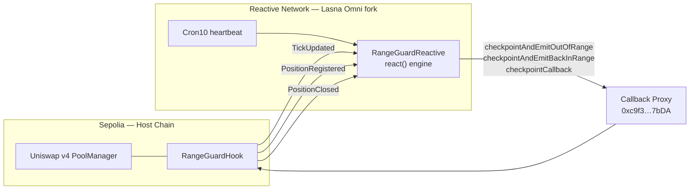
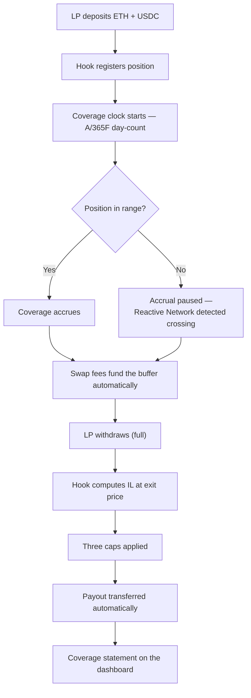

<div align="center">
  

# RangeGuard

> **Protect your liquidity. Guard your range.**


**Live dashboard:** https://range-guard.vercel.app &nbsp;·&nbsp; **Demo video:** https://www.youtube.com/watch?v=82_9mEh_POM

**Sepolia hook:** [`0xFead6CeaD66f86101f0D0fc5A9B97888FA54a7C0`](https://sepolia.etherscan.io/address/0xFead6CeaD66f86101f0D0fc5A9B97888FA54a7C0)  
 **Reactive contract (Lasna Omni):** [`0x5eb9c8C021fB3474aA1f2d9EE5f53f6DbA5fFee1`](https://lasna-omni.reactscan.net/address/0x5eb9c8C021fB3474aA1f2d9EE5f53f6DbA5fFee1)

</div>

---

## Overview

**RangeGuard is a Uniswap v4 hook that gives liquidity providers native, on-chain coverage against impermanent loss.** Every LP who provides liquidity through a RangeGuard pool earns _coverage_ — a capped, on-chain claim that pays out automatically when they withdraw at a loss. The coverage accrues over time, is funded entirely by the pool's own trading activity, and requires no premium, no counterparty, and no off-chain underwriter. **RangeGuard turns impermanent loss into an earned, capped, on-chain claim.**

The system has three parts. A **Uniswap v4 hook** (on Ethereum Sepolia) sits in the swap and liquidity-event path: it charges a dynamic fee, skims a slice of every swap into a coverage _buffer_, accrues coverage for in-range positions, and settles claims on withdrawal. A **Reactive Network contract** (on the Lasna Omni fork) gives the hook autonomy it cannot have on its own — it watches the pool's price, detects when positions cross in or out of range, and drives periodic accrual checkpoints, with no keeper bots and no off-chain infrastructure. A **dashboard** renders each LP's day-by-day coverage statement, reconstructed entirely from on-chain events.

What makes RangeGuard different is in the details. Coverage accrues using the **Actual/365 Fixed day-count convention** — the same standard used in fixed-income finance — which makes IL protection predictable, auditable, and comparable across pools. The buffer is funded by the same swap activity it protects against, so the system is **self-funding with no external subsidies**. And because every figure on an LP's coverage statement maps to a real on-chain event, the entire coverage report is independently verifiable. **Earned over time. Funded by swaps. Settled on-chain.**

---

## The Problem: Impermanent Loss

Liquidity providers earn swap fees, but they take on a hidden risk: **impermanent loss (IL)**. When the price of the pooled assets moves, the AMM automatically rebalances the LP's position — selling the asset that is rising and buying the one that is falling. At withdrawal, the LP can end up with a basket of tokens worth _less_ than if they had simply held the original assets, and the fees earned often fail to cover the gap.

### A concrete example

An LP deposits **1 ETH + 2,000 USDC** when ETH is **$2,000** — a $4,000 position. ETH then falls 50% to **$1,000**. The constant-product AMM rebalances the position along the curve `x · y = k`, leaving the LP with _more_ ETH and _less_ USDC than they started with:

|                      | HODL                        | LP Position                               |
| -------------------- | --------------------------- | ----------------------------------------- |
| Entry (ETH = $2,000) | 1 ETH + 2,000 USDC ($4,000) | 1 ETH + 2,000 USDC ($4,000)               |
| ETH falls to $1,000  | Hold                        | Pool rebalances to 1.414 ETH + 1,414 USDC |
| **Value at exit**    | **$3,000**                  | **$2,828**                                |
| Fees earned          | —                           | ~$20                                      |
| **Net vs HODL**      | —                           | **−$152**                                 |

> **IL = $172** (5.72% of the $3,000 HODL value)
> **Fees earned: ~$20**
> **Net loss vs HODL: −$152**
>
> _No warning. No protection. No recourse._

The 5.72% figure is exact constant-product AMM math: for a price ratio `r = P_exit / P_entry = 0.5`,

```
IL% = 2·√r / (1 + r) − 1 = 2·(0.7071) / 1.5 − 1 = −5.72%
```

In Uniswap v4's **concentrated liquidity** model the effect is amplified: tighter ranges earn more fees but concentrate far more IL exposure. LPs are implicitly selling volatility with no native mechanism to hedge it. RangeGuard is that mechanism.

---

## The Solution: Five Pillars

RangeGuard is built on five design pillars. Each is enforced on-chain.

**Pillar 1 — Accrual Gating.** Coverage accrues _only_ while a position is in range (`tickLower ≤ currentTick < tickUpper`) and is earned on a time basis using a day-count convention. The amount earned is:

```
Coverage earned = Entry Notional × APR × (days in range ÷ 365)
```

Accrual is **lazy** — it is computed only on explicit "touches" (deposit, checkpoint, withdrawal), never by iterating positions. An LP earns nothing for time spent out of range; this is the core fairness rule.

**Pillar 2 — Buffer Funding.** The pool charges a **dynamic fee** equal to `baseLpFeeBps + bufferBps` (always derived, never stored). The base portion goes to LPs as normal; the buffer portion is skimmed into an on-chain coverage _buffer_ on **every** swap, regardless of direction and regardless of whether any position is in range. The buffer that pays claims is funded by the same trading activity that creates IL — no external capital required.

**Pillar 3 — Claim Settlement.** On full withdrawal, the hook measures IL at the exit price and pays the LP from the buffer, subject to three caps applied in order:

```
Payout = min( covered IL, earned coverage, buffer cap )
```

where `covered IL = IL_raw × maxPayoutPctOfIl`, `earned coverage` is the position's accrued coverage, and `buffer cap = bufferBalance × maxPayoutPctOfBuffer`. A `minHoldSeconds` gate blocks payouts on positions held too briefly. Every settlement records a **LimitingFactor** (`IL_CAP`, `COVERAGE_CAP`, or `BUFFER_CAP`) so the LP sees exactly which constraint bound their payout.

**Pillar 4 — LP Transparency (the key differentiator).** RangeGuard's primary feature is the **coverage report**: a complete, verifiable, day-by-day history of a position, generated _entirely from on-chain events_. Every line maps to a real event — `PositionRegistered` → entry snapshot, `AccrualUpdated` → each accrual period, `PositionOutOfRange` / `PositionBackInRange` → pause/resume, `ClaimSettled` → final IL, payout, and limiting factor. No off-chain bookkeeping. The [live dashboard](https://range-guard.vercel.app) reconstructs the entire statement from logs — and because settlement clears the position from storage, the report _must_ live in events, which makes Pillar 4 literal.

**Pillar 5 — Pool Parameterization.** Every `PoolConfig` field (fees, APR, day-count basis, caps, hold period) is **immutable after pool initialization**. Hard bounds are validated _before_ the pool is ever created, so a bad config reverts up front. No admin can change parameters post-init; the only post-init privileged action is `seedBuffer()`.

---

## Architecture

RangeGuard spans two chains. The **hook** lives on the host chain (Ethereum Sepolia) where the Uniswap v4 pool runs. The **reactive contract** lives on the Reactive Network (Lasna Omni fork), where it autonomously watches the hook and drives it. Callbacks flow back to the host chain through the **Callback Proxy**.

### Diagram 1 — Two-Chain Architecture



The hook emits lightweight events (`TickUpdated`, `PositionRegistered`, `PositionClosed`) but **cannot iterate positions in the swap path** (that would be O(N) gas per swap — strictly forbidden) and cannot wake itself when the price moves. `RangeGuardReactive` supplies that missing autonomy: it subscribes to those events plus a `Cron10` heartbeat, tracks each position's range status, and dispatches callbacks back through the Callback Proxy. The reactive contract **never mutates hook accounting** — it only triggers the hook's own `_accrue` and emits report events.

### Diagram 2 — LP Lifecycle



> **No keeper bots. No off-chain infrastructure. Fully autonomous.**

---

## Technical Deep Dive

### 6.1 Hook Mechanics

**Pool setup is two-phase**, because v4's `beforeInitialize` callback receives no `hookData` — per-pool config can't be passed through it.

- **Phase 1 — `stagePoolConfig()`** (`external`, `onlyOwner`): validates every `PoolConfig` bound, the authorized initializer, and the expected `sqrtPriceX96` _before the pool exists_. A bad config reverts here, so the pool can never be created with invalid parameters. Re-stageable until the pool is initialized.
- **Phase 2 — `_beforeInitialize()`** (PoolManager callback): validates `DYNAMIC_FEE_FLAG`, that a staged config exists, that `sender == authorizedInitializer`, and that the price matches — then commits the config atomically and marks the pool initialized.

**`afterAddLiquidity()`** registers the position: it derives `entryAmt0`/`entryAmt1` from the liquidity delta, computes `entryNotionalStable = entryAmt1 + entryAmt0 × P_entry`, snapshots the immutable entry state, runs a `dt = 0` accrual to set the baseline clock, and emits `PositionRegistered`.

**`beforeSwap()`** returns the derived dynamic fee (`baseLpFeeBps + bufferBps`) with the override flag — view-only, no state touched. **`afterSwap()`** does buffer accounting _only_: it credits `|amount1| × bufferBps / FEE_DENOM` into the buffer, emits `BufferFunded`, and emits `TickUpdated` for the Reactive Network. It **never accrues and never iterates positions** — its cost is O(1).

**`beforeRemoveLiquidity()`** is validation-only (active position + full-withdrawal gate). **`afterRemoveLiquidity()`** runs all settlement v4-natively, because the withdrawn amounts only exist _after_ removal: it enforces the `minHoldSeconds` gate, runs a final `_accrue()`, computes IL from the realized `BalanceDelta` (fees included), applies the three-cap payout, and pays out under strict CEI — clearing state and updating the buffer _before_ the token transfer.

**`checkpoint()`** is a permissionless accrual driver (rate-limited by `minCheckpointInterval`). It is the entry point the Reactive Network's heartbeat calls; it is safe to expose publicly because `_accrue` is monotonic, range-gated, and ceiling-capped.

The accrual engine itself:

```solidity
bool isInRange = pos.tickLower <= currentTick && currentTick < pos.tickUpper;
if (isInRange && dt > 0) {
    uint256 yearFraction = (dt * APR_PRECISION) / cfg.secondsPerYear;
    delta = (pos.entryNotionalStable * cfg.coverageApr * yearFraction)
            / (APR_PRECISION * APR_PRECISION);
}
```

### 6.2 Reactive Network Integration

`RangeGuardReactive` runs on the Lasna Omni fork and does two jobs the hook cannot do for itself:

1. **Range-transition detection** — subscribes to `TickUpdated`, tracks per-position range status, and calls `checkpointAndEmitOutOfRange()` / `checkpointAndEmitBackInRange()` on a boundary crossing.
2. **Periodic heartbeat** — subscribes to `Cron10` and calls `checkpointCallback()` for each active position past its `minCheckpointInterval`, keeping lazy accrual current between trades.

Callbacks are authorized by `AbstractCallback` / `onlyServiceProvider` (the call must arrive through the host-chain Callback Proxy). The full integration story — including two Omni-fork pitfalls found and fixed on-chain — is in [Section 10](#reactive-network-integration) and **[docs/reactive-evidence.md](docs/reactive-evidence.md)**.

### 6.3 Day-Count Convention

This is the detail that separates RangeGuard from an ad-hoc IL rebate. Coverage is not a flat percentage — it is **earned interest on the LP's notional**, accrued by time in range, using the **Actual/365 Fixed (A/365F)** convention from fixed-income finance.

> _Coverage accrual using A/365F makes IL protection predictable, auditable, and comparable across pools — the same standard used in fixed-income bond markets._

A/365F means: count the **actual** number of seconds a position is in range, and divide by a **fixed 365-day year** (31,536,000 seconds). A position with a $10,000 notional at 50% APR that stays in range for 30 days earns `$10,000 × 0.50 × (30 ÷ 365) = $410.96` of coverage. The same position out of range earns nothing for that time. Because the convention is fixed and explicit, an LP — or an auditor — can reproduce every accrual figure from first principles.

This is enforced on-chain: only **A/365F (`31,536,000`)** or **A/360 (`31,104,000`)** are accepted at pool initialization. Any other `secondsPerYear` reverts with `UnsupportedDayCount`. There is no floating, no oracle, and no off-chain interest curve — the day-count basis is part of the immutable `PoolConfig`.

### 6.4 Gas Efficiency

The most gas-critical path is **`afterSwap`** — it runs on _every_ swap. RangeGuard adds **46,414 gas** with **no unbounded iteration**. **O(1) by design.**

| Function               | Avg gas    | Notes                                |
| ---------------------- | ---------- | ------------------------------------ |
| **`afterSwap`**        | **46,414** | Constant cost, O(1), no LP iteration |
| `checkpoint`           | 56,455     | Permissionless accrual driver        |
| `afterRemoveLiquidity` | 61,922     | Full settlement path                 |
| `afterAddLiquidity`    | 163,872    | One-time per position                |
| `beforeInitialize`     | 212,967    | One-time per pool                    |

_Source: `forge test --gas-report`. The committed `.gas-snapshot` baseline (deterministic tests only) is CI-gated against regressions via `forge snapshot --check`. See [docs/coverage-summary.md](docs/coverage-summary.md)._

---

## Live Deployment

### Sepolia Testnet (host chain)

| Contract                          | Address                                                                                          |
| --------------------------------- | ------------------------------------------------------------------------------------------------ |
| RangeGuardHook                    | [`0xFead…a7C0`](https://sepolia.etherscan.io/address/0xFead6CeaD66f86101f0D0fc5A9B97888FA54a7C0) |
| MockUSDC (token1)                 | [`0x04fe…28CA`](https://sepolia.etherscan.io/address/0x04feCef5110c5e52794fdA3D935BC2Cc0ee428CA) |
| DemoLPRouter                      | [`0xEA30…1FEa`](https://sepolia.etherscan.io/address/0xEA30a770E6B3C3d30074908Af13b930d6d451FEa) |
| PoolManager (Uniswap v4)          | [`0xE03A…3543`](https://sepolia.etherscan.io/address/0xE03A1074c86CFeDd5C142C4F04F1a1536e203543) |
| PoolId (ETH/USDC, dyn-fee, ts=60) | `0x3e2f931d495879c5ff87e338192def0f0b824bdf07e9f9c16b02cdba34aaa61a`                             |

### Reactive Network (Lasna Omni fork)

| Contract                         | Address                                                                                              |
| -------------------------------- | ---------------------------------------------------------------------------------------------------- |
| RangeGuardReactive               | [`0x5eb9…Fee1`](https://lasna-omni.reactscan.net/address/0x5eb9c8C021fB3474aA1f2d9EE5f53f6DbA5fFee1) |
| Callback Proxy (Lasna → Sepolia) | [`0xc9f3…7bDA`](https://sepolia.etherscan.io/address/0xc9f36411C9897e7F959D99ffca2a0Ba7ee0D7bDA)     |
| SYSTEM contract                  | `0x8888888888888888888888888888888888888888`                                                         |

### Pool Configuration

| Parameter                    | Demo value          |
| ---------------------------- | ------------------- |
| `baseLpFeeBps`               | 3,000 (0.30%)       |
| `bufferBps`                  | 1,000 (0.10%)       |
| `coverageApr`                | 50% (`0.50e18`)     |
| `secondsPerYear`             | 31,536,000 (A/365F) |
| `minHoldSeconds`             | 300 (5 minutes)     |
| `minCheckpointInterval`      | 120 (2 minutes)     |
| `maxPayoutPctOfIl`           | 50%                 |
| `maxPayoutPctOfBuffer`       | 10%                 |
| `maxAccruedCoverageMultiple` | 3× notional         |
| `targetBufferSize`           | 100,000 USDC        |

> **Live vs. demo settlement (honest note).** The position settled live on Sepolia closed as **`PartialPayout` / `COVERAGE_CAP`** — a real, sparse on-chain statement (entry notional 228.69 USDC). The fuller **`IL_CAP` / `ClaimSettled`** narrative (a simulated 45-day lifecycle: 12.51 USDC coverage earned → 2.23 USDC paid, IL cap binding) is the Foundry fork demo, shown in the dashboard's clearly-labeled `?demo=true` view and in the recorded video. Both are accurate; neither is overstated as the other.

---

## Running Locally

### Prerequisites

- [Foundry](https://getfoundry.sh/) (pinned to **1.3.5** — gas is toolchain-sensitive)
- Node.js 22.x
- Git

### Install

```bash
git clone https://github.com/garykocsis/RangeGuard
cd RangeGuard
cp .env.example .env
# Fill in PRIVATE_KEY and SEPOLIA_RPC_URL
```

The repo vendors its dependencies (`forge-std`, `v4-core`, `reactive-lib-omni`) directly under `lib/`, so a fresh clone builds with no submodule init.

### Build & test

```bash
forge build

# Deterministic suite (278 tests, no RPC needed)
forge test

# Full suite incl. 14 Sepolia fork tests (292 total — requires SEPOLIA_RPC_URL)
forge test --fork-url $SEPOLIA_RPC_URL

# CI fuzz profile (10,000 runs)
forge test --profile ci
```

### Gas & coverage

```bash
forge snapshot                       # regenerate the gas baseline
make gas-check                       # run the exact CI gas-regression gate locally
forge coverage --report summary --no-match-coverage "(test|script)/"
```

### Deploy (Sepolia + Lasna Omni)

```bash
# 1. Deploy MockUSDC (testnet token1)
forge script script/DeployMockUSDC.s.sol --broadcast --rpc-url $SEPOLIA_RPC_URL

# 2. Deploy the hook (CREATE2 + HookMiner for the permission-bit address)
forge script script/DeployRangeGuardHook.s.sol --broadcast --rpc-url $SEPOLIA_RPC_URL

# 3. Deploy the reactive contract (Lasna Omni fork)
forge script script/DeployRangeGuardReactive.s.sol --broadcast --rpc-url $REACTIVE_RPC_URL

# 4. MANDATORY: fund the hook's reserve on the Callback Proxy (else callbacks never land)
make fund-hook-proxy
make reserves-hook       # verify reserves(hook) > 0
```

### Frontend

```bash
cd frontend
npm install
npm run dev        # → http://localhost:5173
```

---

## Test Suite

**292 tests passing** across unit, fuzz, invariant, and integration suites (**278 deterministic + 14 Sepolia fork**).

| Suite       | Tests | Description                                                            |
| ----------- | ----- | ---------------------------------------------------------------------- |
| Unit        | ~180  | Per-function correctness with fixed inputs                             |
| Fuzz        | ~40   | Property-based, 1,000 runs (CI: 10,000)                                |
| Invariant   | ~30   | State-machine properties (500 runs × 50,000 calls/campaign, 0 reverts) |
| Integration | ~42   | Full lifecycle + Sepolia fork tests                                    |

### Coverage

- **Total:** 98.45% lines · 98.51% statements
- **`RangeGuardHook.sol`:** 100% lines · 100% functions
- **`RangeGuardReactive.sol`:** 100% lines · 100% functions

The two shipped contracts are fully covered. The aggregate sits below 100% only because of intentional non-shippable items — `MockUSDC.sol` (testnet-only ERC-20 mock, never on mainnet) and the vendored `AbstractPausableReactive` ReactVM-detection branches (resolve only on the live Lasna Omni runtime, structurally unreachable in the Foundry EVM). Full breakdown in **[docs/coverage-summary.md](docs/coverage-summary.md)**.

### Key invariants tested

- Coverage never decreases (monotonic accrual) and never exceeds the ceiling
- Inactive / out-of-range positions never accrue
- Buffer conservation: `bufferBalance + totalPaidOut == seed + totalSkimmed`
- Payout never exceeds any of the three caps
- `PoolConfig` is immutable after initialization
- The three reactive functions are callable _only_ via the Callback Proxy

---

## Reactive Network Integration

The **Reactive Network Lasna Omni fork** is a unified EVM environment built on CometBFT consensus with ~1-second block times. Unlike the legacy ReactVM sandbox model, the Omni fork runs a standard EVM execution layer where reactive contracts subscribe to cross-chain events and dispatch callbacks through an official **Callback Proxy**. The system contract at `0x8888888888888888888888888888888888888888` replaces the legacy service contract at `0x…fffFfF`. Reactive contracts inherit from `AbstractPausableReactive` and use `onlySystem` (`msg.sender == SYSTEM`) for ReactVM-restricted execution, rather than the legacy `vmOnly` heuristic.

RangeGuard uses this layer to give the hook autonomy it cannot have on its own — the hook cannot iterate positions in the swap path (O(N), forbidden) and cannot wake itself on a price move.

### Job 1 — Range-transition detection

The hook emits `TickUpdated` on every swap. `RangeGuardReactive` subscribes to it, tracks per-position range status, and calls `checkpointAndEmitOutOfRange()` / `checkpointAndEmitBackInRange()` when a boundary crossing is detected. No keeper bots. No off-chain infrastructure.

### Job 2 — Periodic heartbeat

Coverage accrual is lazy — it only advances on explicit touches. Without regular checkpoints, coverage reports would show large gaps. `RangeGuardReactive` subscribes to `Cron10` and calls `checkpointCallback()` for each active position that has exceeded `minCheckpointInterval`.

### The migration story (real engineering)

- **Session 12 — initial deployment.** `RangeGuardReactive` was first deployed against the **legacy Lasna testnet** (pre-Omni fork), built on `reactive-lib` v0.2.0 with the ReactVM sandbox model and the legacy service contract.
- **Session 13 — the network had moved.** We discovered the Reactive Network had upgraded to the **Omni fork** — the unified EVM described above (CometBFT consensus, ~1-second blocks, new system contract at `0x8888…8888`). The legacy network was deprecated.
- **Migration.** This required moving `reactive-lib` → `reactive-lib-omni`, finding and fixing **two breaking changes**, and redeploying to the Lasna Omni fork:
  1. **`vmOnly` → `onlySystem`.** The pre-Omni ReactVM detection (`extcodesize(0x8888) == 0`) is permanently false on Lasna Omni's unified EVM, so `react()` reverted on _every_ delivered event. Fixed by gating on `msg.sender == SYSTEM`.
  2. **Callback Proxy reserve model.** The host-chain proxy draws destination-chain gas from `reserves(hook)`, not the hook's raw ETH balance — funding the balance does nothing. Fixed by `proxy.depositTo{value}(hook)`, codified as `make fund-hook-proxy` (mandatory after any hook redeploy).

Both pitfalls were diagnosed from on-chain state and are now documented as mandatory steps so the next integrator doesn't lose hours to silent failures. On-chain evidence — subscription, bidirectional range detection via `lastKnownInRange` flips, rGas accounting per dispatch, and the full position lifecycle — is captured with transaction hashes and `cast` reads in **[docs/reactive-evidence.md](docs/reactive-evidence.md)**.

### Payload convention & authorization

**Payload convention (legacy carry-forward):** Hook functions accept a leading `address` placeholder — a convention from the legacy Lasna ReactVM where the network overwrote the first 160 bits of each callback with the calling contract's ReactVM ID. This placeholder is retained in the current deployment for compatibility but will be removed in the Omni fork v2 upgrade (see Roadmap).

> **Current authorization model:** `onlyServiceProvider` verifies the callback arrived through the official Callback Proxy ([`0xc9f36411C9897e7F959D99ffca2a0Ba7ee0D7bDA`](https://sepolia.etherscan.io/address/0xc9f36411C9897e7F959D99ffca2a0Ba7ee0D7bDA)). The hook cannot currently verify _which_ specific reactive contract triggered the call — this is acceptable for testnet but will be upgraded to `onlyCallbackSender(rangeGuardReactiveOrigin)` before mainnet deployment (see [Roadmap](#roadmap)).

---

## Roadmap

### MVP — complete

- [x] `RangeGuardHook` — full IL-coverage lifecycle (setup → accrual → buffer → settlement)
- [x] `RangeGuardReactive` — autonomous cross-chain automation (Lasna Omni fork)
- [x] Sepolia + Lasna Omni deployment, wired and verified
- [x] Frontend coverage-report dashboard
- [x] 292 passing tests (98.45% coverage; both shipped contracts 100%)

### Phase 2 — Mainnet hardening

- [ ] **Reactive Network Omni fork v2 upgrade:** The current deployment uses the legacy callback pattern with a leading `address` RVM-ID placeholder and `onlyServiceProvider` authorization (verifies the call arrived via the official Callback Proxy but cannot verify which specific reactive contract triggered it). The Omni fork v2 pattern removes the placeholder and adds `onlyCallbackSender(rangeGuardReactiveOrigin)` — enabling exact reactive-contract verification for stronger security guarantees before mainnet deployment.
- [ ] Spec §11 view functions (`getCurrentFee`, `getBufferHealth`, `getEstimatedPayout`, `getEarnedCoverage`, …) — _not yet implemented on the deployed hook; planned for mainnet hardening._
- [ ] TWAP / oracle price for IL calculation (vs. current spot price)
- [ ] Partial withdrawals
- [ ] Volatility-responsive dynamic fee
- [ ] Separate vault contract for buffer custody
- [ ] Multisig admin
- [ ] **`DemoLPRouter.sol` hardening:** Add ERC20 transfer return-value
      checks (currently unchecked — acceptable for MockUSDC testnet
      demo, not production-ready).
- [ ] **Fee currency reconciliation:** The coverage buffer is denominated
      in USDC (token1) but swap fees in an ETH/USDC pool are generated
      in either USDC or ETH depending on swap direction. The MVP handles
      this by seeding the buffer with real USDC via `seedBuffer()` and
      accounting for fee contributions in USDC terms — but ETH-denominated
      fees do not automatically create spendable USDC. A mainnet
      implementation requires native fee collection plus ETH→USDC
      conversion (e.g. via a Uniswap swap or Chainlink price feed) so
      that `bufferBalanceStable` always reflects actual payable USDC
      reserves rather than notional value.

### Phase 3 — Production

- [ ] Mainnet deployment
- [ ] Security audit
- [ ] Multiple-pool support (beyond the ETH/USDC demo)
- [ ] LP premium mechanism

---

## Documentation

| Document                                               | Description                                |
| ------------------------------------------------------ | ------------------------------------------ |
| [spec.md](spec.md)                                     | Full technical specification (v2.1)        |
| [context.md](context.md)                               | Architecture context and design decisions  |
| [reactiveSpec.md](reactiveSpec.md)                     | Reactive Network integration specification |
| [state-machine.md](state-machine.md)                   | Position and pool lifecycle state machines |
| [invariant-mapping.md](invariant-mapping.md)           | Protocol invariants                        |
| [testing-strategy.md](testing-strategy.md)             | Test-suite architecture                    |
| [docs/reactive-evidence.md](docs/reactive-evidence.md) | Cross-chain integration proof (on-chain)   |
| [docs/coverage-summary.md](docs/coverage-summary.md)   | Test-coverage breakdown                    |
| [frontend/README.md](frontend/README.md)               | Frontend dashboard setup                   |

---

## License

MIT — see [LICENSE](LICENSE).
